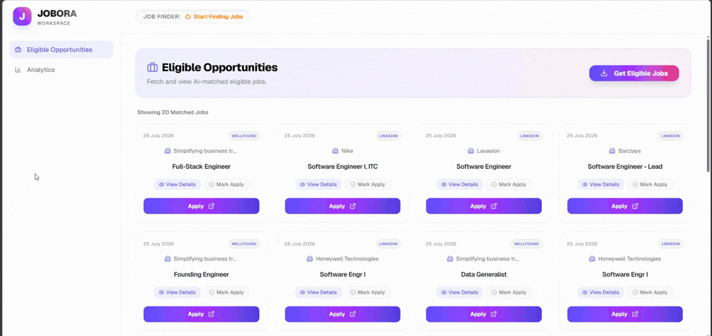

# Jobora

  <em>An autonomous full-stack job application and analytics platform.</em>

  

## 📖 What is this?
Jobora is an intelligent, end-to-end automation system designed to take the hassle out of finding and applying for jobs. It automatically scrapes various job portals, cleans and processes the job descriptions using AI (LLMs), evaluates them against a personal profile, and presents the eligible matches on a beautiful, interactive dashboard along with detailed application analytics.

## 📸 Screenshots

### Analytics Dashboard

  

  

### Job Table & Details

  

  

### Eligible Opportunities

  

## 🗂️ Project Structure

The project is modular and separated into three distinct services. **For deep technical details, setup instructions, and environment variables, please refer to the dedicated READMEs inside each directory:**

- **[`frontend/`](./frontend/README.md)**: The user-facing dashboard built with React 19, Vite, and Tailwind CSS. It allows you to view analytics, manage eligible jobs, and trigger the automation bots.
- **[`backend/`](./backend/README.md)**: The core API server and automation engine built with Node.js and Express. It serves data to the frontend, manages the PostgreSQL & Redis databases, and orchestrates the Puppeteer-based web scraping bots on local Microsoft Edge instances.
- **[`ai/`](./ai/README.md)**: The background worker application built with Python and LangGraph. It processes raw jobs from the queue, structures the text using Hugging Face LLMs, and evaluates the candidate's eligibility against their profile.

## 🔗 Repository
- **Repo Link:** [https://github.com/DhirajKarangale/Jobora](https://github.com/DhirajKarangale/Jobora)
- **Branch:** `main`

## 🏗️ System Architecture

The Jobora system operates through a carefully orchestrated data flow:

1. **Automation Trigger**: The user initiates the automation process from the **Frontend** dashboard. This sends an API request to the **Backend**.
2. **Data Scraping**: The **Backend** launches a local instance of Microsoft Edge (utilizing an existing authenticated profile to bypass bot detection) and concurrently scrapes multiple job portals (LinkedIn, Instahyre, Wellfound, Naukri, Cutshort).
3. **Data Storage & Queueing**: Raw job postings are saved directly to a **PostgreSQL** database. Simultaneously, the job IDs are pushed to a **Redis** stream (`jobora_process`) which acts as a message queue.
4. **AI Processing Pipeline**: The **AI** background workers continuously poll the Redis queue. When a job ID is picked up, they:
   - Fetch the raw data from PostgreSQL.
   - Run a stateful AI pipeline (LangGraph) to *Clean* the HTML/noise and *Structure* the data (skills, salary, experience) into strict JSON formats.
   - *Evaluate* the structured requirements against the candidate's local profile (`Dhiraj_Karangale_Profile.md`).
5. **Final Output**: The AI worker updates the PostgreSQL record with the structured data and the final `is_eligible` boolean flag. This processed data is then instantly available to be visualized and managed on the **Frontend** dashboard.

## 🚀 How to Run the Project

Because Jobora is split into three distinct modules, each requires its own dependencies and environment setup.

You will need to open three separate terminal windows and follow the step-by-step instructions provided in their respective README files:

1. **Frontend**: Go to the `frontend` directory and read [frontend/README.md](./frontend/README.md)
2. **Backend**: Go to the `backend` directory and read [backend/README.md](./backend/README.md)
3. **AI Processor**: Go to the `ai` directory and read [ai/README.md](./ai/README.md)

Generally, the flow for each module involves:
- Navigating to the directory (`cd frontend`, `cd backend`, `cd ai`).
- Installing dependencies (e.g., `npm install`, `pip install -r requirements.txt`).
- Configuring `.env` files with necessary variables (Database credentials, API URLs, Hugging Face tokens).
- Running the development/worker startup command (e.g., `npm run dev`, `python .\src\main.py`).

---

> *Note: This system is not perfect and is still evolving.*

 

  <strong>-DK-</strong>

